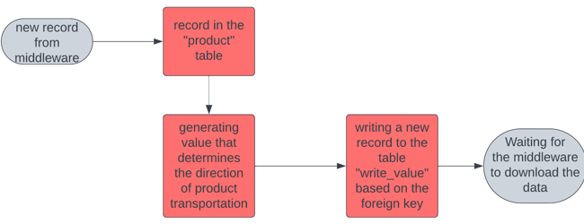

# Warehouse_Flow_Management_App
Aplication for product flow management in a warehouse. Python - Midealware, MySQL -  Product Database, SCL - Integration of Visualization, RFID Label Handling  

# About

## Links
Programs are fully tasted, presentation in links below:  
<strong> Warehouse Control </strong> - https://youtu.be/LajZa_TnCQ0  

## Tools

<strong> TiaPortal </strong>  
<strong> S7-PLCSIM Advanced </strong>  
<strong> Python </strong>  
<strong> MySQL </strong>

## The application makes the connection as follows: 

## Functional Principle: 

The control responses come from the MySQL database. 
The function block that manages the flow of information in the PLC is called "Station_Management."
Motion and scanners functions you can find in my other respository.

## Function "Station_Management" workflow diagram

## WorkFlow in MySQL Database

